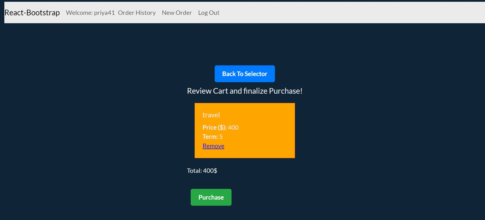
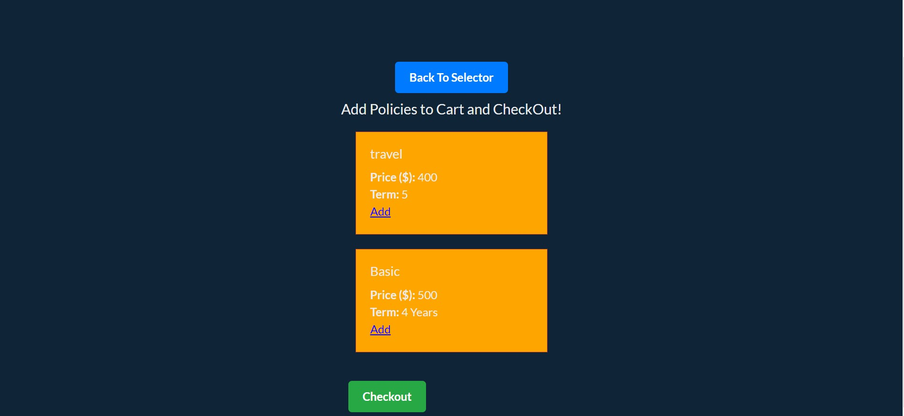
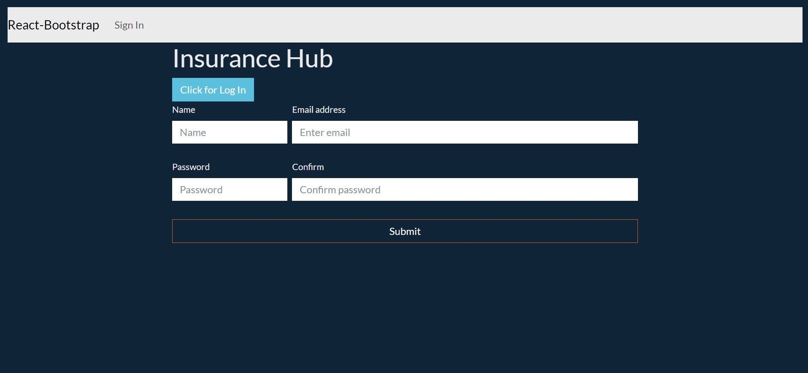
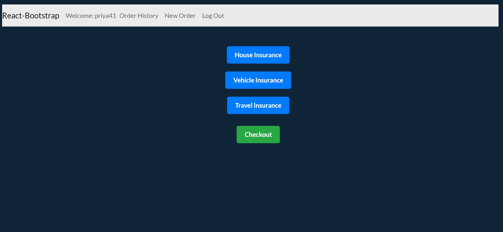

App Title: Insurance Hub

About:
Insurance Hub website is a one  with user authentication, role-based access control (admin and end user), and policy management functionality. 

Authentication:

User registration with secure password storage.
User login with JSON Web Tokens (JWT) for authentication.
Differentiate between admin and end user roles during login.

Admin Functionality:

Admin login with specific admin credentials.
Ability to regulate policies, which may include:
Changing policy details.
Deleting policies.

End User Functionality:

User can select a policy category.
User can view and select policies within the chosen category.
checkout the slected policies.

Insurance hub: Screenshot

Technologies Used:
Incorporate the technologies of the MERN-stack:
MongoDB
Express
React.js
Node.js
React Bootstrap

Getting Started
https://trello.com/b/iuDMOcE7/capstone-project -trello link
https://dashboard.heroku.com/apps/priyangainsurancehub- heroku link

Next Steps:
scheduler for policy renuals
adding renuals functionality 